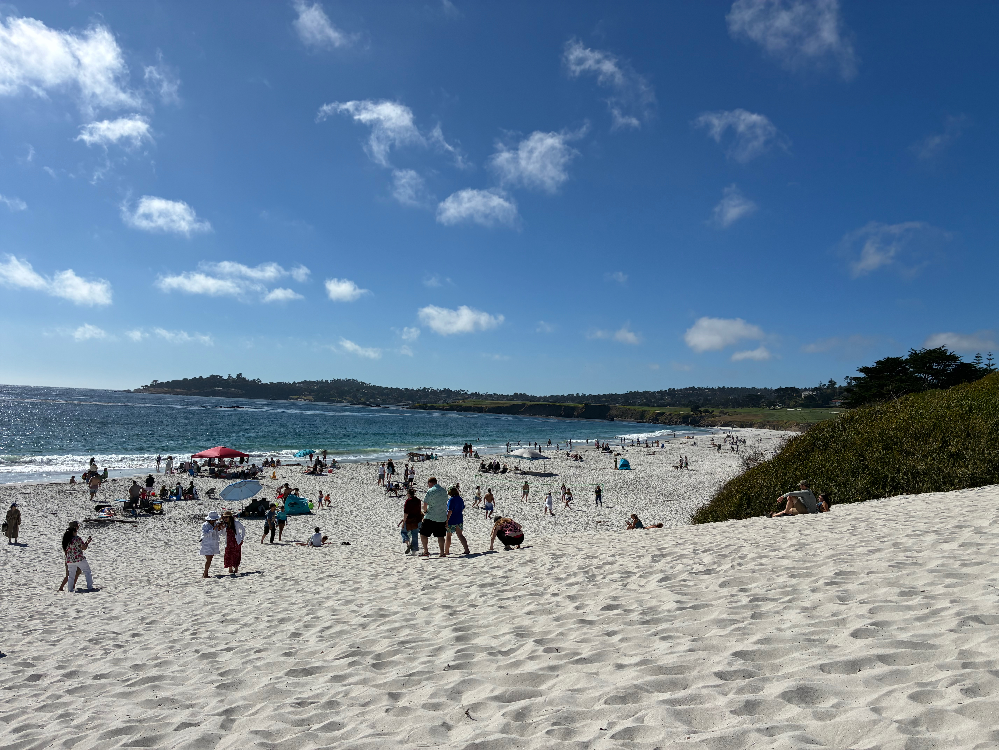

It was our last full day in Morro Bay on Wednesday, and we decided to visit
Hearst Castle since it was so gloomy and there was zero surf. So, we made a
similar drive to Sand Dollar and just rode the 1 up a bit past San Simeon and
made it to the visitors center. Hearst Castle was all about preservation (almost
to the extreme) and don't allow you to just drive up to the Castle, so we waited
for our shuttle.

When we got up there, the Castle itself is on a hill over looking San Simeon
Bay. The entrance is quite grand and when walking up the smooth ceramic steps,
you see the [Neptune Pool][]:

Don't you just want to jump in it? It looks so refreshing I had to ask the tour
guide if I could even touch the water and got hit with a firm "No". I guess it
will just have to be my life mission to get past all of their security gates and
cameras and find a way to swim in that pool. Definitely became a bucket list
item with that response.

Anyways, the rest of the tour was great and I'd definitely recommend it to
anyone in the area. We just did the [Grand Rooms Tour][] and that was more than
enough for us. We had thought about doing multiple tours since there was so much
to see, but by the end we felt we had seen enough and were ready to head back
towards Morro.

The rest of the day was spent in SLO doing a little window shopping, watching
_The Odyssey_, and getting a drink and some food at Black Sheep.

## Road Trip North through Paso Robles



Next morning was the typical airbnb pack before leaving. We got out with 15
minutes to spare before our 10AM checkout time. Didn't surf as it was completely
flat, so yet another rest day to give the shoulders a break. Today, we'd be
driving up to Carmel but passing some time driving through Paso Robles and
Adelaida to see the vineyards. But first, breakfast at [Dorn's Breakers Cafe][]!
All I've gotta say: bring your appetite. This is my new favorite breakfast spot
in Morro Bay and for a fair price. Ate my weight in steak and eggs, pancakes and
potatoes with some of the best fresh-squeezed OJ I'd ever had. Definitely
recommend.

After breakfast, we wound our way up the 101 through Paso Robles and onto
Adelaide street. When passing through Paso Robles, I thought we would be hit
immediately with vineyards and expansive farm land, but we really were in a
normal California town right up until we hit Adelaide street. Then, we began our
drive through rolling vineyards.



We originally had a reservation for [Halter Ranch][] at 2PM, but we had hit
Adelaide around 12PM, so we had some time to kill. My original thought was to
just follow Adelaide to Chimney Rock Rd and do a full loop and swing back to
Halter, but then we passed a quaint little vineyard, [Tolo Cellars][].

I'd had the windows down the whole drive to Tolo since it was so nice out, so it
was nice to stop for a little and just enjoy the scenery. Pulling up the dirt
driveway and parking, we got out of the car and walked up to the tasting room; a
wide open door under a main red guest house. As we approached, we heard laughter
and voices! We were not alone in this tasting room. Luckily, there was only one
other couple in there and they were very pleasant and already knew one of the
owners, Josh, very well.

So we tried some wine, got to know them (from LA) and Josh and talked about
everything from work, what to do in California, and some stories about their
experiences with the previous earthquakes. Now, my favorite wines were the 2021
Leros and the 2021 R. Delos. Elise really liked the 8 Buckets Blanc (I'm not the
biggest fan of white wines).

After a bit, the couple had to leave as they too had a reservation at Halter
Ranch they had to get to. So we were left talking with Josh and trying wines. As
he poured more wine, we went out to his small farm and met his chickens and he
showed us some of the berries and vegetables he was growing. Then, it was time
for us to leave sadly, and to make the experience even better, Josh didn't
charge us a dime! So kind. They do ship, so I'm considering getting some wine
shipped home later.

## Closing out in Carmel



Leaving Paso Robles, we finished our hike back up the 101 to Carmel-by-the-Sea.
We were staying just on the outskirts of town in Mission Fields. When we got to
the location, we just relaxed a bit and took a nap to sleep off some of the
wine. Then, for a late dinner, we went to [Hog's Breath Inn][]. It was a super
unique restaurant and bar and was founded by Clint Eastwood... I guess he was
the Mayor of Carmel for a time.

That next morning? I was on the hunt for some surf. We headed south on the 1 and
tried for [Big Sur Rivermouth][] as I heard is was a solid spot with the heavy
NW winds we had. Once we got there, I learned the hard way that a SW swell on
that spot really lead to mushy conditions and really nothing to surf. Welp, at
least the drive was pretty. I'd met a teacher who was out there surfing and he
was telling me the only reason he was out there was to avoid the crowds. I guess
localism is pretty heavy at that spot, so make sure to respect the elders there.
Once I saw him go out and catch next to nothing, we decided to call it and go
have a beach day at Carmel beach.

After that we just took the day slow. Shopped around Carmel, got some candy and
then went to a grocery store to get a pizza and watch Project Hail Mary at the
airbnb. It was nice to have a slow day because for the final day, I'd had it
with experimenting with Big Sur and decided to hit old reliable, Pleasure Point.



The next morning I didn't get on the road until ~8AM, meaning I didn't get to
Santa Cruz until ~9:30AM and in the water until ~9:45AM. All that to say there
were a fuck ton of people and it really would have paid off to have a dawn
patrol morning.

There were people everywhere all trying to catch the same rolling sets that
would come in every 10-20 minutes. Between 10:10 and 10:45 there was next to
nothing and only small swells that longboarders could snag. I will say, this was
my first session with the 6'3" Al Merrick and it was so much easier to catch
waves on it. Would have been smart to take it out when the waves calmed down in
Morro honestly since the tail and nose are much more buoyant, it's much more
forgiving allowing me to catch waves at the last second by throwing the tail
into the water and getting a little extra push on the rebound.

Anyways, I was able to catch a few waves and leave with enough stoke to focus on
catch Superior waves when I get back home. When I got back to Carmel, Elise was
shopping in town, so I took advantage of the hot, sunny day and fully dewaxxed
both of my boards.



To close out the trip, we had one more drink at the Hog's Breath Inn as I had to
try Eastwood's Date Old Fashioned, and then grabbed some Italian and a bottle of
wine at [Little Napoli][]. We had the Truffled Gnocchi to start followed up with
Ragù Bolognese ‘Obama’ for me and the Roasted Salmon for the lady and finally
Tiramisù for dessert. Man it was good. Great way to finish the trip!

So, to sum up, we did quite a bit this trip and I'd love to come back to
SloCal/NorCal for vacation as it was a great way to escape the heat and get a
quietish vacation in California. I'm sure San Diego would be _extremely_ busy,
so happy we were able to get some peace and quiet in Morro.

We had to drop the car off early, so I'm finishing this post up while we sit for
6 hours in the San Francisco airport preparing for real life. Wish us luck!

[Big Sur Rivermouth]: https://surfcaptain.com/forecast/big-sur-california
[Dorn's Breakers Cafe]: https://www.dornscafe.com/
[Grand Rooms Tour]: https://hearstcastle.org/tour/grand-rooms-tour/
[Halter Ranch]: https://www.halterranch.com/
[Hog's Breath Inn]: https://hogsbreathinn.net/
[Little Napoli]: https://chefpepe.com/restaurants/little-napoli/
[Neptune Pool]: https://hearstcastle.org/the-castle/pools/
[Tolo Cellars]: https://www.tolocellars.com/index.html
