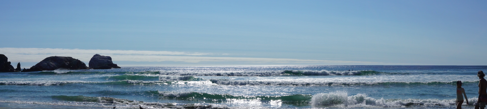



We found an absolute gem of a beach yesterday. The morning started slow, but I
eventually hit Morro Rock to surf the long board swells until lunch. Caught a
few fun ones, but the competition for the waves was stiff. Longboarders can
really cover a lot more ground than I can on my 5'10" fish board.

Anyways, once I got back, we hit Carla's Kitchen for some brunch and decided to
hit Big Sur and get out of Morro for a beach day. We mapped it out and planned
to check on Moonstone Beach in Cambria and if we didn't like that, we'd make the
extra hour-long haul to get to Sand Dollar. And boy am I glad we did.



Getting to the beach itself was no small feat. The road is extremely windy
through the mountains and requires constant speed adjustments. Add in the locals
aren't too patient when following tourists and it was a little stressful getting
there. Probably about 45 minutes of mountain driving so if you go, make sure
it's on a good weather day and you're ready for it.

_Side note_: once we got there, we realized we didn't have $10 for the parking
box, so we risked it and didn't pay. Was probably fine since it wasn't a busy
day, but just another thing to think about if you go.

If getting to the beach is hard to drive to, hiking down to the beach is equally
hard. It's about a quarter mile hike down and increasingly steep hill side and
the path is not well-maintained. Dirt most of the way and narrow stairs to get
down to the beach. We joked that once we retire, we weren't sure we would be
able to make to this beach anymore. However, the mix of difficulty to drive and
hike to the beach keeps enough people away that once you get down to Sand
Dollar, you're rewarded with uncrowded, white sandy beaches in a cove with great
surf. Huge!



There's essentially no shade and no access to fresh water, so if I went back,
I'd make sure to bring an umbrella and plenty of liquids as we eventually had to
surrender to the sun and leave. We were red when we left even after constantly
reapplying sun screen, so a little escape from the sun would have been ideal.
The water? Absolutely freezing, so it helped keep us there for 4 hours by just
jumping into the ocean to cool off and then soak up the sun to heat back up
again.

The surf itself? When I got there, I didn't realize it, but I was catching the
tail end of a solid interval. I'd caught a couple and then it was about an hour
of paddling to keep my position (there was a strong channel pulling me north)
and being patient with wave selection. What I should have done, was immediately
call it once the waves died down and wait for the sunset surf as it did pick
back up, but once the sunset surf _did_ hit, my shoulders were spent and I just
couldn't get back out there.

All-in-all, that was one of the best beaches I'd ever been to. Made for a
fantastic day and I can't wait to come back.

